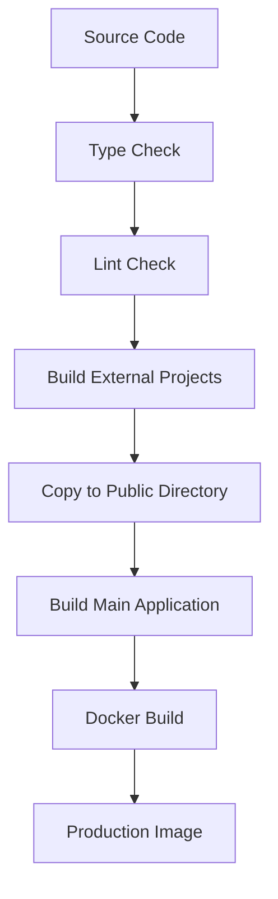

# Architecture Documentation - "the copy"

## Overview

"the copy" is a unified production-ready web application that integrates three powerful AI-powered platforms into a single, cohesive user experience. The application uses a micro-frontend architecture with embedded SPAs (Single Page Applications) served through a unified interface.

## System Architecture

```
┌─────────────────────────────────────────────────────────────┐
│                    "the copy" Application                   │
├─────────────────────────────────────────────────────────────┤
│  Main Application (React + TypeScript + Vite)              │
│  ├── HomePage (Navigation Hub)                             │
│  ├── ProjectsPage → Drama Analyst (iframe)                 │
│  ├── TemplatesPage → Stations (iframe)                     │
│  └── ExportPage → Multi-Agent Story (iframe)               │
├─────────────────────────────────────────────────────────────┤
│  External Applications (Embedded SPAs)                     │
│  ├── Drama Analyst (/drama-analyst/)                       │
│  ├── Stations (/stations/)                                 │
│  └── Multi-Agent Story (/multi-agent-story/)              │
├─────────────────────────────────────────────────────────────┤
│  Infrastructure Layer                                      │
│  ├── Nginx (Static File Server + Routing)                 │
│  ├── Docker (Containerization)                            │
│  └── CI/CD Pipeline (GitHub Actions)                      │
└─────────────────────────────────────────────────────────────┘
```

## Component Architecture

### Main Application Components

#### 1. App.tsx
- **Purpose**: Root component managing application state and routing
- **Responsibilities**: Page navigation, state management
- **Dependencies**: React Router, custom page components

#### 2. HomePage.tsx
- **Purpose**: Main navigation hub
- **Features**: 
  - Application branding ("the copy")
  - Navigation buttons to external applications
  - Responsive design with Arabic RTL support

#### 3. ExternalAppFrame.tsx
- **Purpose**: Robust iframe wrapper for external applications
- **Features**:
  - Error boundaries with retry logic
  - Loading states and progress indicators
  - Automatic retry on failure (max 3 attempts)
  - Graceful fallback handling
  - Security sandboxing

#### 4. Page Components
- **ProjectsPage.tsx**: Integrates Drama Analyst
- **TemplatesPage.tsx**: Integrates Stations
- **ExportPage.tsx**: Integrates Multi-Agent Story

### External Applications

#### Drama Analyst (`/drama-analyst/`)
- **Technology**: React 19, TypeScript, Vite, PWA
- **Purpose**: Arabic drama analysis and creative mimicry
- **Features**: AI-powered text analysis, document processing, creative content generation
- **Port**: 5001 (development)
- **Build Output**: `public/drama-analyst/`

#### Stations (`/stations/`)
- **Technology**: React 18, TypeScript, Vite, Express backend
- **Purpose**: REST API and management system
- **Features**: Full-stack application, database integration, user authentication
- **Port**: 5002 (development)
- **Build Output**: `public/stations/`

#### Multi-Agent Story (`/multi-agent-story/`)
- **Technology**: React 18, TypeScript, Vite, Fastify backend
- **Purpose**: Multi-agent storytelling development platform
- **Features**: AI agent system, story development tools, real-time collaboration
- **Port**: 5003 (development)
- **Build Output**: `public/multi-agent-story/`

## Build System

### Build Pipeline



### Build Scripts

- `npm run build:external`: Builds all external projects
- `npm run build:prod`: Complete production build
- `npm run verify:all`: Quality gates (type-check + lint + test)

### External Project Build Process

1. **Dependency Installation**: `npm ci` in each project directory
2. **Clean Build**: Remove existing dist folders
3. **Build**: `npm run build` for each project
4. **Copy**: Move built files to `public/<project-name>/`
5. **Validation**: Verify build success and file presence

## Deployment Architecture

### Docker Configuration

#### Multi-Stage Build
1. **External Builder**: Builds all external projects
2. **Main Builder**: Builds main application with external projects
3. **Production Runtime**: Nginx server with built application

#### Security Features
- Non-root user execution
- Security headers (CSP, HSTS, etc.)
- Rate limiting
- Input validation
- Sandboxed iframes

### Nginx Configuration

#### Routing Rules
- `/` → Main application
- `/drama-analyst/` → Drama Analyst SPA
- `/stations/` → Stations SPA
- `/multi-agent-story/` → Multi-Agent Story SPA
- `/healthz` → Health check endpoint

#### Performance Optimizations
- Gzip compression
- Static asset caching (1 year)
- HTML no-cache policy
- Brotli compression (optional)

## Data Flow

### User Interaction Flow

1. **User visits main application**
2. **HomePage renders with navigation options**
3. **User clicks on external application button**
4. **Page component loads with ExternalAppFrame**
5. **ExternalAppFrame creates iframe with external app**
6. **External app loads and communicates via postMessage**
7. **Error handling and retry logic manage failures**

### Build Data Flow

1. **Source code changes trigger CI/CD**
2. **Quality gates run (type-check, lint, test)**
3. **External projects build in parallel**
4. **Built projects copied to public directory**
5. **Main application builds with external projects**
6. **Docker image created with all assets**
7. **Image deployed to production**

## Security Considerations

### Content Security Policy (CSP)
- Restricts script sources to self and trusted domains
- Prevents XSS attacks
- Controls iframe embedding

### Iframe Sandboxing
- `allow-same-origin`: Allows same-origin requests
- `allow-scripts`: Enables JavaScript execution
- `allow-forms`: Allows form submissions
- `allow-popups`: Enables popup windows
- `allow-modals`: Allows modal dialogs

### Network Security
- HTTPS enforcement
- Secure headers
- Rate limiting
- Input sanitization

## Performance Characteristics

### Bundle Sizes
- Main Application: ~228KB (gzipped: ~68KB)
- External Projects: < 1MB each (gzipped)
- Total Application: < 5MB

### Load Times
- First Contentful Paint: < 2s
- Time to Interactive: < 3s
- External App Load: < 5s

### Caching Strategy
- Static Assets: 1 year cache
- HTML Files: No cache
- API Responses: 5 minutes cache

## Monitoring and Observability

### Health Checks
- Application health: `/healthz`
- Docker health check: Every 30s
- External app monitoring: Iframe load events

### Error Tracking
- Console error capture
- Network error monitoring
- Build failure notifications
- Performance metrics

### Logging
- Build logs: `reports/build-logs/`
- Application logs: Docker logs
- Error logs: Console + network errors

## Development Workflow

### Local Development
1. `npm run dev` - Start main application
2. External projects run on separate ports
3. Hot reload for main application
4. Manual refresh for external projects

### Production Deployment
1. Code pushed to main branch
2. CI/CD pipeline triggers
3. Quality gates must pass
4. Docker image built and pushed
5. Production deployment automated

## Maintenance and Updates

### External Project Updates
1. Update external project source
2. Rebuild external projects
3. Test integration
4. Deploy updated application

### Security Updates
1. Update dependencies
2. Run security audit
3. Test for vulnerabilities
4. Deploy security patches

### Performance Optimization
1. Monitor performance metrics
2. Identify bottlenecks
3. Optimize bundle sizes
4. Implement caching strategies

## Troubleshooting

### Common Issues
1. **External app not loading**: Check iframe src, network connectivity
2. **Build failures**: Verify dependencies, check build logs
3. **Performance issues**: Monitor bundle sizes, check caching
4. **Security issues**: Review CSP, check iframe sandboxing

### Debug Tools
- Browser DevTools for iframe debugging
- Docker logs for container issues
- Build logs for compilation problems
- Network tab for connectivity issues

## Future Enhancements

### Planned Features
1. **Micro-frontend communication**: PostMessage API
2. **Shared state management**: Global state store
3. **Progressive loading**: Lazy load external apps
4. **Offline support**: Service worker integration

### Scalability Considerations
1. **CDN integration**: Static asset distribution
2. **Load balancing**: Multiple container instances
3. **Database integration**: Shared data layer
4. **API gateway**: Centralized API management