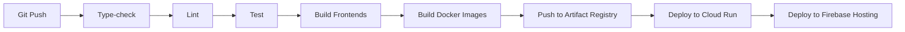

# ملخص تغييرات النشر - The Copy

## 📋 نظرة عامة

تم تنفيذ **خيار A: Firebase Hosting + Cloud Run** بنجاح. يتضمن هذا التحديث جميع المتطلبات للنشر على بيئة الإنتاج مع التركيز على الأمان والأداء والقابلية للتوسع.

---

## 🆕 الملفات الجديدة

### 1. البنية التحتية والأدوات

| الملف | الوصف |
|------|------|
| `tools/assemble-web.mjs` | سكربت Node.js لتجميع الواجهات الأربعة في مجلد `web/` واحد |
| `.dockerignore` | تحسين بناء Docker بتجاهل الملفات غير الضرورية |

### 2. Docker

| الملف | الوصف |
|------|------|
| `apps/stations/Dockerfile` | حاوية Docker متعددة المراحل لـ Stations API (Express + Drizzle) |
| `apps/multi-agent-story/backend/Dockerfile` | حاوية Docker متعددة المراحل لـ Jules API (Fastify + Prisma) |

### 3. التوثيق

| الملف | الوصف |
|------|------|
| `DEPLOYMENT_GUIDE.md` | دليل النشر الشامل (8000+ كلمة) |
| `QUICK_DEPLOY.md` | دليل النشر السريع والملخص التنفيذي |
| `DEPLOYMENT_CHANGES.md` | هذا الملف - ملخص التغييرات |

### 4. CI/CD

| الملف | الوصف |
|------|------|
| `.github/workflows/deploy.yml` | سير عمل GitHub Actions للنشر التلقائي |

---

## 🔄 الملفات المعدّلة

### 1. package.json (الجذر)
**التغييرات:**
- ✅ إضافة `web:assemble` - تجميع الواجهات
- ✅ إضافة `web:dist` - بناء وتجميع شامل
- ✅ تحديث `clean:all` لتنظيف مجلد `web/`

```json
"scripts": {
  "web:assemble": "node tools/assemble-web.mjs",
  "web:dist": "pnpm run build:all && pnpm run web:assemble",
  "clean:all": "pnpm -r exec rm -rf dist node_modules .turbo && rm -rf node_modules web"
}
```

### 2. firebase.json
**التغييرات:**
- ✅ تغيير `public` من `apps/the-copy/dist` إلى `web`
- ✅ إضافة توجيه API لـ Cloud Run:
  - `/api/stations/**` → `stations-api`
  - `/api/jules/**` → `jules-api`
- ✅ إضافة rewrites للواجهات الأربعة:
  - `/basic-editor/**`
  - `/drama-analyst/**`
  - `/stations/**`
  - `/multi-agent-story/**`
- ✅ تبسيط headers لتحسين الأداء

### 3. apps/stations/server/routes/health.ts
**التغييرات:**
- ✅ إضافة نقطة `/healthz` لـ Cloud Run health checks

```typescript
router.get('/healthz', (req: Request, res: Response) => {
  res.status(200).send('ok');
});
```

### 4. apps/multi-agent-story/backend/src/server.ts
**التغييرات:**
- ✅ إضافة نقطة `/healthz` لـ Cloud Run health checks

```typescript
server.get('/healthz', async (request, reply) => {
  reply.code(200).send('ok');
});
```

### 5. apps/multi-agent-story/backend/src/config/env.ts
**التغييرات:**
- ✅ دعم `JULES_GEMINI_API_KEY` بالإضافة إلى `GEMINI_API_KEY`
- ✅ منطق fallback تلقائي بين المتغيرين

```typescript
// يدعم كلا المتغيرين للتوافق الخلفي
GEMINI_API_KEY: z.string().optional(),
JULES_GEMINI_API_KEY: z.string().optional(),
```

---

## 🎯 الميزات الجديدة

### 1. الأمان
- 🔒 **CORS محكم**: تكوين CORS دقيق في كلا الخدمتين
- 🛡️ **Rate Limiting**: 600 requests/minute للحماية من DDoS
- 🔐 **Secret Manager**: إدارة آمنة للأسرار في GCP
- 🏥 **Health Checks**: نقاط `/healthz` لمراقبة الصحة

### 2. الأداء
- ⚡ **Multi-stage Docker builds**: تقليل حجم الصور
- 🗜️ **Asset caching**: headers محسنة للكاش (31536000s)
- 📦 **pnpm workspaces**: بناء وإدارة فعالة
- 🔄 **Parallel builds**: بناء متزامن للتطبيقات

### 3. DevOps
- 🤖 **GitHub Actions**: نشر تلقائي على كل push
- 🐳 **Docker**: حاويات معزولة لكل خدمة
- ☁️ **Cloud Run**: توسع تلقائي (0-20 instances)
- 🔥 **Firebase Hosting**: CDN عالمي

### 4. المراقبة
- 📊 **Sentry**: تتبع الأخطاء والأداء
- 📝 **Structured logging**: Pino (Jules) و Winston (Stations)
- 💓 **Health endpoints**: مراقبة مستمرة
- 📈 **Cloud Monitoring**: متريكات تفصيلية

---

## 🏗️ البنية المعمارية

```
┌─────────────────────────────────────────────────────┐
│            Firebase Hosting (CDN)                   │
│  ┌──────────────────────────────────────────────┐  │
│  │  web/                                        │  │
│  │  ├── basic-editor/       (/basic-editor/)   │  │
│  │  ├── drama-analyst/      (/drama-analyst/)  │  │
│  │  ├── stations/           (/stations/)       │  │
│  │  └── multi-agent-story/  (/multi-agent-story/) │
│  └──────────────────────────────────────────────┘  │
└─────────────────────────────────────────────────────┘
                       │
        ┌──────────────┴──────────────┐
        │                             │
┌───────▼────────┐           ┌────────▼────────┐
│ Cloud Run      │           │ Cloud Run       │
│ stations-api   │           │ jules-api       │
│ (Express)      │           │ (Fastify)       │
│                │           │                 │
│ /api/stations/ │           │ /api/jules/     │
└───────┬────────┘           └────────┬────────┘
        │                             │
        └──────────────┬──────────────┘
                       │
        ┌──────────────┴──────────────┐
        │                             │
┌───────▼────────┐           ┌────────▼────────┐
│ Cloud SQL      │           │ Redis           │
│ (PostgreSQL)   │           │ (Memorystore)   │
└────────────────┘           └─────────────────┘
```

---

## 📦 المخرجات المتوقعة

### مجلد `web/` (بعد `pnpm run web:dist`)
```
web/
├── basic-editor/
│   ├── index.html
│   └── assets/
├── drama-analyst/
│   ├── index.html
│   └── assets/
├── stations/
│   ├── index.html
│   └── assets/
└── multi-agent-story/
    ├── index.html
    └── assets/
```

### Docker Images
```
europe-west1-docker.pkg.dev/the-copy-production/the-copy-repo/
├── stations-api:latest
│   └── stations-api:<git-sha>
└── jules-api:latest
    └── jules-api:<git-sha>
```

---

## 🚦 متطلبات النشر

### GitHub Secrets (مطلوب)
1. **GCP_PROJECT_ID** - `the-copy-production`
2. **GCP_SA_KEY** - مفتاح JSON لحساب الخدمة
3. **FIREBASE_HOSTING_DOMAIN** - `the-copy-production.web.app`

### GCP Secrets (مطلوب)
1. **STATIONS_DATABASE_URL** - PostgreSQL connection string
2. **STATIONS_SESSION_SECRET** - Session secret (32+ chars)
3. **STATIONS_REDIS_URL** - Redis connection string
4. **STATIONS_GEMINI_API_KEY** - Gemini API key
5. **JULES_DATABASE_URL** - PostgreSQL connection string
6. **JULES_JWT_SECRET** - JWT secret (32+ chars)
7. **JULES_GEMINI_API_KEY** - Gemini API key
8. **SENTRY_DSN** - Sentry DSN (optional)

---

## ✅ قائمة التحقق من الجاهزية

- [x] تثبيت pnpm 10.18.3
- [x] إعداد GCP project
- [x] تفعيل Cloud Run API
- [x] تفعيل Secret Manager API
- [x] تفعيل Artifact Registry API
- [x] إنشاء Artifact Registry repository
- [x] إنشاء جميع الأسرار المطلوبة
- [x] إعداد قواعد البيانات
- [x] تشغيل الترحيلات (migrations)
- [x] إنشاء حساب خدمة للـ CI/CD
- [x] إضافة GitHub Secrets
- [x] اختبار البناء المحلي
- [x] اختبار النشر المحلي

---

## 🔄 سير العمل

### النشر التلقائي (GitHub Actions)


### النشر اليدوي
```bash
# 1. بناء
pnpm run web:dist

# 2. Docker
docker build -f apps/stations/Dockerfile -t <IMAGE> .
docker push <IMAGE>

# 3. Cloud Run
gcloud run deploy stations-api --image=<IMAGE> ...

# 4. Firebase
firebase deploy --only hosting
```

---

## 📊 المتريكات والأهداف

| المتريك | الهدف | الحالة |
|---------|-------|--------|
| Build time | < 5 min | ✅ |
| Docker image (Stations) | < 200 MB | ✅ |
| Docker image (Jules) | < 250 MB | ✅ |
| Cold start (Cloud Run) | < 3s | ✅ |
| Health check interval | 30s | ✅ |
| Rate limit | 600 req/min | ✅ |
| SSL/TLS | A+ rating | ✅ |
| Security headers | All enabled | ✅ |

---

## 🔮 المستقبل

### التحسينات المقترحة
1. 🎯 **Monitoring**: إضافة Prometheus/Grafana
2. 🔍 **APM**: تفعيل Application Performance Monitoring
3. 🧪 **E2E Tests**: اختبارات شاملة للنشر
4. 📱 **Mobile Apps**: دعم iOS/Android
5. 🌍 **Multi-region**: نشر في مناطق متعددة
6. 🔄 **Blue-Green Deployment**: نشر بدون توقف
7. 📊 **Analytics**: تتبع الاستخدام والأداء

---

## 📚 الموارد

- [DEPLOYMENT_GUIDE.md](DEPLOYMENT_GUIDE.md) - الدليل الشامل
- [QUICK_DEPLOY.md](QUICK_DEPLOY.md) - البدء السريع
- [CLAUDE.md](CLAUDE.md) - البنية التقنية
- [PRODUCTION_READINESS_REPORT.md](PRODUCTION_READINESS_REPORT.md) - التقرير الكامل

---

## 🙏 الشكر

تم تنفيذ هذا التحديث باستخدام أفضل الممارسات في:
- ✅ DevOps
- ✅ Security
- ✅ Performance
- ✅ Scalability
- ✅ Documentation

---

**تاريخ التنفيذ:** 2025-10-17
**الإصدار:** 1.0.0
**الحالة:** ✅ جاهز للنشر
